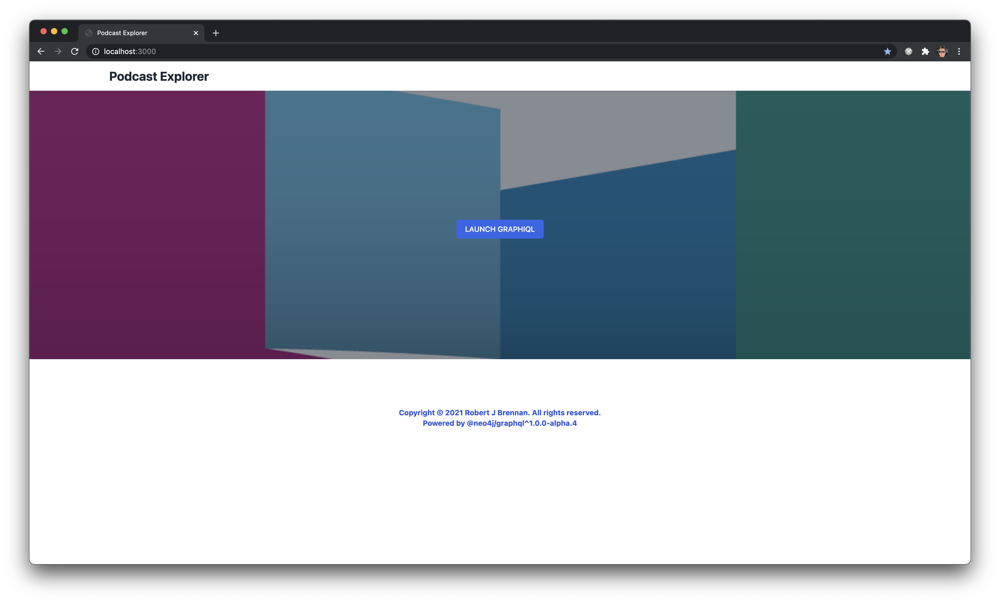

# Podcast Explorer

This project is a continuation of my [Heimdall](https://github.com/TheRobBrennan/heimdall) project - which explores using the new alpha release of the [@neo4j/graphql](@neo4j/graphql) library within a [GRANDstack](https://grandstack.io) ([GraphQL](https://graphql.org), [React](https://reactjs.org), [Apollo](https://www.apollographql.com), [Neo4j Database](https://neo4j.com)) application.




## Getting started

To run this example, all you need to have installed on your development system is [Docker](https://www.docker.com) and [Node.js](https://nodejs.org/).

If you do not have [Docker](https://www.docker.com) installed on your development system, go to freely available [Docker Desktop](https://www.docker.com/products/docker-desktop) and get that installed and configured on your development machine.

First, copy `app/.env.sample` to `app/.env` - the default settings should work with the Dockerized project without any additional customization.

```sh
#
# ---------------------------------------------------------------------------
# EXAMPLE ./app/.env
# ---------------------------------------------------------------------------
# Neo4j v4.x.x Community Edition [DOCKER]
NEO4J_URI=bolt://neo4j:7687
NEO4J_USER=neo4j
NEO4J_PASSWORD=letmein
# Additional settings for Neo4j v4.x.x Community and Enterprise Editions
#NEO4J_ENCRYPTED=true
#NEO4J_DATABASE=neo4j
# ---------------------------------------------------------------------------
```

Once you have created an `./app/.env` file, you can run the project with a single command to build the Docker services defined in `./docker-compose.yml` and start your application with `npm run dev`

You should be able to access the following URLs:

- [http://localhost:3000](http://localhost:3000) - The frontend for our Next.js application
- [http://localhost:3000/api/graphql](http://localhost:3000/api/graphql) - The GraphIQL explorer for our backend Next.js API which will be a serverless GraphQL function on [Vercel](https://vercel.com)
- [http://localhost:3000/api/ping](http://localhost:3000/api/ping) - A sample API route that will be a serverless function on [Vercel](https://vercel.com)
- [http://localhost:7474/browser/](http://localhost:7474/browser/) - This is the Neo4j Browser application that you can use to explore your Neo4j database - as well as run Cypher commands to seed your database with example data. You can log in with `neo4j` as the user, and `letmein` as the password

### Testing

Once your application has been built and is running, there are several test scripts in the root `./package.json`:

- `test` - Assuming you have your Docker containers running, this script will run the entire test suite for our Next.js web application.
- `test:ci` - Assuming you have your Docker containers running, this script will run the entire test suite for our Next.js web application with Jest assuming it is running in a Continuous Integration (CI) environment.
  - See [https://jestjs.io/docs/en/cli#--ci](https://jestjs.io/docs/en/cli#--ci) for more details.
- `test:coverage` - Assuming you have your Docker containers running, this script will run the entire test suite for our Next.js web application and generate a code coverage report.
- `test:coverage:view` - If you run this script locally, be sure to install all of the dependencies for the Next.js web application (`$ cd app && npm install`) before running this script.
  - If you are on macOS, this script will run the entire test suite for our Next.js web application, generate a code coverage report, and attempt to open the generated report (available at `app/coverage/lcov-report/index.html`) with your default browser.
- `test:verbose` - Assuming you have your Docker containers running, this script will run the entire test suite for our Next.js web application in verbose mode. This will display the individual test results within the test suite.
  - See [https://jestjs.io/docs/en/cli#--verbose](https://jestjs.io/docs/en/cli#--verbose) for more details.
- `test:watch` - If you run this script locally, be sure to install all of the dependencies for the Next.js web application (`$ cd app && npm install`) before running this script.
  - If you are on macOS, this script will watch files for changes and only run tests for our Next.js web application impacted by current code changes.
  - See [https://jestjs.io/docs/en/cli#--watch](https://jestjs.io/docs/en/cli#--watch) for more details.
